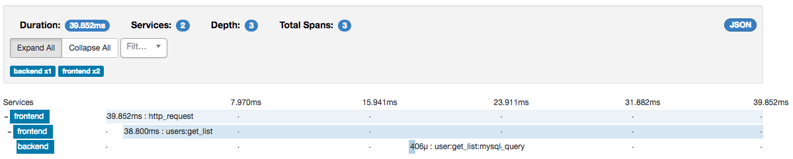

# Zipkin PHP example

This is an example app where two php services collaborate on an 
http request. Notably, timing of these requests are recorded into
Zipkin, a distributed tracing system.

This allows you to see the how long the whole operation took, as 
well how much time was spent in each service.

This example uses the [jcchavezs/zipkin](https://github.com/jcchavezs/zipkin-php) library.



## Requirements
- [Composer](https://getcomposer.org/doc/00-intro.md#installation-linux-unix-osx)
- [Docker](https://docs.docker.com/engine/installation/) (optional, if you have a zipkin endpoint this is not needed)

## Running the example

This example has two services: frontend and backend. They both report 
trace data to zipkin.

To setup the demo, do

```bash
// As of zipkin php is still in 1.0.0-betaX
rm composer.lock && composer install
```

Once the dependencies are installed, run the services:

```bash
# Run zipkin (optional):
composer run-zipkin

# In terminal 1:
composer run-frontend

# In terminal 2
composer run-backend

```

And then, request the frontend:
 
```
curl http://localhost:8081
```

1. This starts a trace in the frontend (http://localhost:8081/)
2. Continues the trace and calls the backend (http://localhost:9000)
3. Next, you can view traces that went through the backend via http://localhost:9411/?serviceName=frontend.
